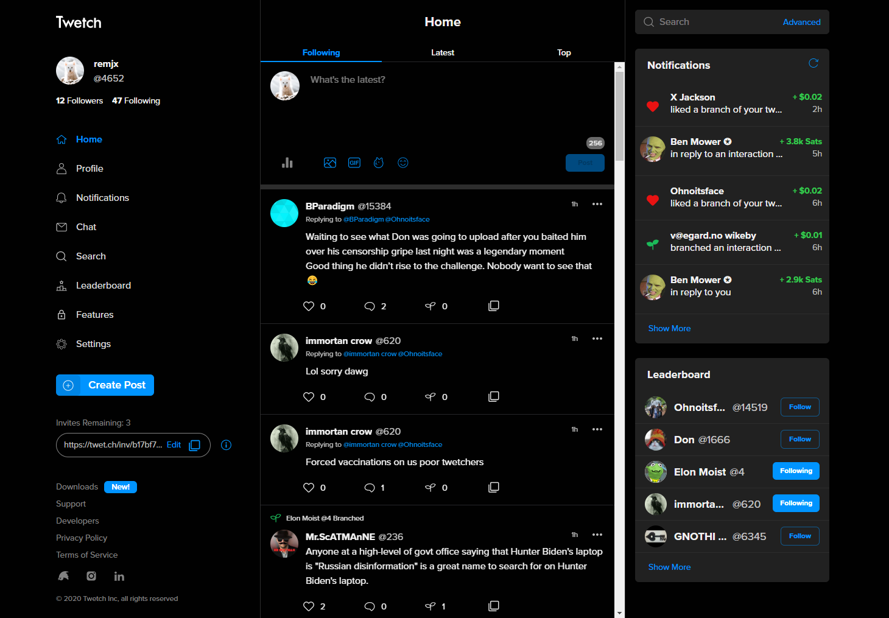
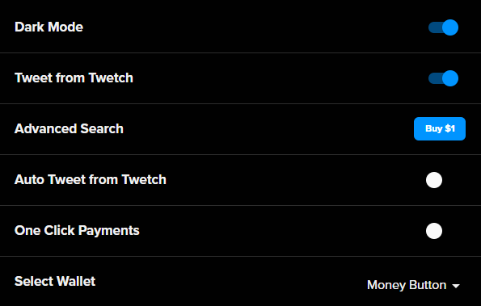
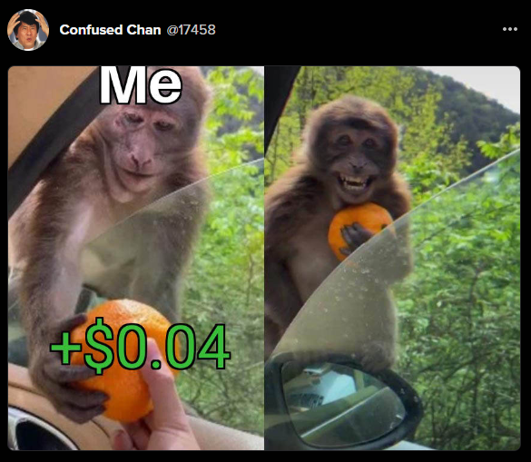
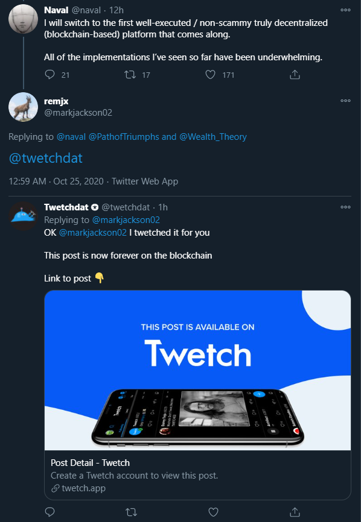

import links from '../../../src/config/links.json'

<h2 id="what-is-twetch">What is Twetch?</h2>

[Twetch](https://twetch.app) is a decentralized social media network running on Bitcoin SV. Launched in February 2019, Twetch looks and feels like [Twitter](https://twitter.com), but with some important differences that make it a compelling alternative. The killer feature? **You earn money every time someone interacts with your content** 🤑 

<h2 id="what-is-bitcoin-sv">What is Bitcoin SV?</h2>

[Bitcoin SV (BSV)](https://bitcoinsv.io/) is the [blockchain](https://en.wikipedia.org/wiki/Blockchain) and currency used by Twetch. It works under the hood and is mostly invisible to the user.

The important thing to know is that Bitcoin SV is a [version](https://www.investopedia.com/terms/h/hard-fork.asp) of [Bitcoin](https://bitcoin.org/bitcoin.pdf) whose primary differentiator is its unlimited block size. Whereas Bitcoin (BTC) and Bitcoin Cash (BCH) have fixed block size limits (1MB and 32MB respectively), Bitcoin SV (BSV) removes the limit entirely. With big blocks, it is possible for users to make low-fee microtransactions (fractions of a cent) and host data on-chain.

Twetch utilizes these capabilities of Bitcoin SV's as we shall see.

## Twetch vs. Twitter: What's the difference?

What's wrong with Twitter? Is [@jack](https://twitter.com/jack) evil? Why use Twetch? Let's dive in 🤿

### Posts live forever on the blockchain ♾️

Every user interaction on Twetch is a BSV transaction under the hood. This means every Post, Like, and Reply is public, timestamped, and immutable.

For example, [this is the Bitcoin transaction](https://search.matterpool.io/tx/11b05d8ca4f5b1084ede31c2b8f9e4d1c0d493f0d16c45051aec9d072f50a1dd) that represents this Twetch post:

In this decentralized model where user data exists on a public blockchain, the data layer and the app layer are separate. The app simply provides a viewing window into the public data and ways to interact with it. Whereas Twitter is the only party with an up-to-date copy of all its user's data, Twetch pulls all its user's data from the public blockchain.

This independence of data increases competition and transparency while reducing monopolistic network effects. If Twetch implements a policy its users don't like (e.g. censoring posts, banning users), the user data is still publicly available. Anyone can leverage the public data and create their own version of Twetch that doesn't implement those disagreeable business policies. Under the current centralized models of Twitter and Facebook, if you don't like their policies, your only option is to leave.

### Pay-to-interact and earn money when users engage with your content 🤑

Twetch has a built-in economic system based on microtransactions.

As it stands today:

<ul style="list-style-type:none">
    <li>➕ Creating a post costs 2¢</li>
    <li>🌱 Branching (the Twetch equivalent of Retweeting) costs 3¢</li>
    <li>❤️ Liking a post costs 5¢</li>
    <li>👀 Following a user costs 10¢</li>
</ul>

A tiny fraction of these costs go to the Bitcoin miners, ~10% goes to Twetch, and the other ~90% goes to the user you are interacting with. Because the interactions are transactions are on Bitcoin, payouts are instant.

If you get 10 Likes on a post, you'll earn ~$1! If you get 100 Likes, you'll earn ~$10! Scale up or down as necessary based on your popularity and meme abilities 😉

And it goes further. If Person A branches to your post, and Person B interacts with the branch, you split the earnings from Person B's interaction with Person A.

> Note: interaction fees are set by Twetch and have lowered as the userbase has increased. I expect them to continue tweaking the incentive structure, but I don't expect any drastic changes.

### No ads 🚫

There are no advertisements on Twetch. As mentioned above, Twetch earns a small commission from each user interaction. There are also optional paid features such as Dark Mode and Advanced Search:

### Encrypted chat 💬

Chat privately fren2fren™ with end-to-end encrypted messaging. There is a one-time fee of $9.99 to unlock this feature, although if someone else initiates the chat, it's free. There are no limits on number of chats or number of messages within a chat. [Click here](https://www.zdnet.com/article/blockchain-based-twitter-competitor-twetch-releases-encrypted-chat-app/) to learn how it works at a technical level.

## What's the catch?

Twetch has a small community compared to Twitter's gargantuan 150,000,000 users. As of October 2020, Twetch is just under 2 years old with about 20,000 users.

The UI is quite good but not as refined as Twitter's.

You won't find many popular accounts to follow, but you can create a [Windbell](https://windbell.app/) to duplicate any public Twitter account onto Twetch (and earn a 21.8% revenue share from all engagement with the Twetch account). For example I created the [Tim Ferriss Bot](https://twetch.app/u/17108).

There is no native Lists functionality, but you can create a [Windbell Mix](https://windbell.app/mix/) to replicate that feature.

In short, there's no catch, but the ecosystem is not as developed as Twitter's.

## What's the verdict?

My humble opinion is that Twitter users should not expect to ditch it anytime soon. The community is much larger and diverse. There are people who don't want to pay to post. There are circumstances where you don't want a post to exist immutably on the blockchain. I don't see these things changing any time soon.

On the flipside, Twetch provides some utility that Twitter does not. Making money off each interaction is an innovative concept with a definite future in certain applications. It really comes down to utilizing each platform for its unique communities and capabilities.

If Twetch sounds interesting to you, try it out for a bit and see if you like the community. Try to earn some money from your followers. Get indoctrinated by the memes:

Just kidding about the last one. But if you want a glimpse at what the future of social media might look like, Twetch is definitely worth checking out!

## How to get started

### Sign up

Twetch is currently invite only, but there are multiple ways you can get in:

- Click the invite link on [Twetch's Twitter profile](https://twitter.com/twetchapp)
- Ask for an invite from an existing user. I have some extra invites: <a href={links.myTwitterUrl}>DM me on Twitter</a> if you need one
- Sign up on the public waitlist at [twetch.app](https://twetch.app)

Once you click the invite link, it's basically a two-step process:
1. Create and fund a supported Bitcoin wallet ([MoneyButton](https://www.moneybutton.com/money), [RelayX](https://www.relayx.com/), or [DotWallet](https://www.dotwallet.com/en/))
2. Accept your invite and link your Twetch account to your Bitcoin wallet

### Follow some interesting accounts

Here are a few of my favorites:

- <a href={links.myTwetchUrl}>@4652 remjx (me!)</a>
- [@24 Cosmos Stagittarius a.k.a. Daniel Krawisz](https://twetch.app/u/24)
- [@931 T.K. Coleman](https://twetch.app/u/931)
- [@4179 Steve Patterson](https://twetch.app/u/4179)

> User numbers are fixed, but you can change your display name at any time.

### Use /commands to trigger actions in posts

- `/pay @user $amount` to pay a user directly from your BSV wallet
- `/trolltoll @user $amount` to prevent a user from interacting with you unless they pay the troll toll. `/trolltoll remove @user` to remove it.

### Write any Twitter post to the BSV blockchain

On Twitter, reply `@twetchdat` to any post, and the twetchdat bot will convert it into a Twetch post. [For example](https://twitter.com/markjackson02/status/1320228429564870656),

## Developer API

The official [twetch-js](https://github.com/twetch-inc/twetch-js) package can be used to create interactions programmatically.

## The End

Feel free to reach out to me on <a href={links.myTwitterUrl}>Twitter</a> or <a href={links.myTwetchUrl}>Twetch</a> for any comments, questions, corrections, etc.
