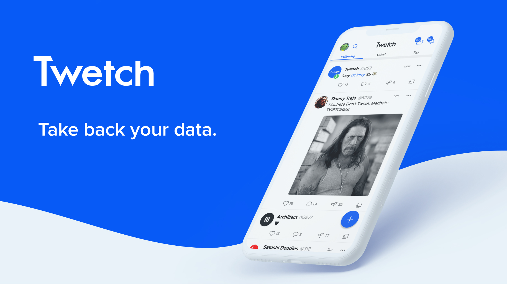

import links from '../../../src/config/links.json'

<h2 id="what-is-twetch">What is Twetch?</h2>

[Twetch](https://twetch.app) is a decentralized social media network running on Bitcoin SV. Launched in February 2019, Twetch looks and feels like [Twitter](https://twitter.com), but with some important differences that make it a compelling alternative. The killer feature? **You earn money every time someone interacts with your content** 🤑 

<h2 id="what-is-bitcoin-sv">What is Bitcoin SV?</h2>

Bitcoin SV works under the hood and is mostly invisible to the user. However, Twetch will make more sense if you understand it within the context of Bitcoin.

[Bitcoin SV (BSV)](https://bitcoinsv.io/) is the blockchain and currency used by Twetch.

Bitcoin SV is a [version](https://www.investopedia.com/terms/h/hard-fork.asp) of [Bitcoin](https://bitcoin.org/bitcoin.pdf) whose primary differentiator is its unlimited block size. Whereas Bitcoin (BTC) and Bitcoin Cash (BCH) have fixed block size limits (1MB and 32MB respectively), Bitcoin SV (BSV) removes the limit entirely. With big blocks, it is possible for users to make low-fee "microtransactions" for fractions of a cent and host data on-chain.

Twetch utilizes many of Bitcoin SV's capabilities as we shall see.

## Twetch vs. Twitter: What's the difference?

What's wrong with Twitter? Is [@jack](https://twitter.com/jack) evil? Why use Twetch? Let's dive in 🤿

### Posts live forever on the blockchain ♾️

Every user interaction on Twetch is a BSV transaction under the hood. This means every post is public, timestamped, and immutable.

For example, [this is the Bitcoin transaction](https://search.matterpool.io/tx/11b05d8ca4f5b1084ede31c2b8f9e4d1c0d493f0d16c45051aec9d072f50a1dd) that represents this Twetch post:

In this decentralized model where user data exists on a public blockchain, the data layer and the app layer are separate. The app simply provides a private viewing window into the public data and ways to interact with it. Whereas Twitter is the only party who has an up-to-date copy of all its user's data, Twetch pulls all its user's data from the public blockchain.

This independence of data increases competition and transparency while reducing monopolistic network effects. If Twetch implements a policy its users don't like (e.g. censoring posts, banning users), the user data is still publicly available. Anyone can leverage the public data and create their own version of Twetch that doesn't implement those disagreeable business policies. Under the current centralized models of Twitter and Facebook, if you don't like their policies, your only option is to leave.

### Pay-to-post and earn money when users engage with your content 🤑

Twetch has a built-in economic system based on microtransactions.

Posting fees have gotten lower as the userbase has increased, but as it stands today:

<ul style="list-style-type:none">
    <li>➕ Creating a post costs 2¢</li>
    <li>🌱 Branching (the Twetch equivalent of Retweeting) costs 3¢</li>
    <li>❤️ Liking a post costs 5¢</li>
    <li>👀 Following a user costs 10¢</li>
</ul>

A tiny fraction of these costs go to the Bitcoin miners, ~10% goes to Twetch, and the other ~90% goes directly to the user you are interacting with.

For example, if you get 10 Likes on a post, you'll earn ~$1! If you get 100 Likes, you'll earn ~$10! Scale up or down as necessary based on your popularity and meme abilities 😉

It goes further. If Person A replies to your post, and Person B Likes Person A's post, you also earn money off that.

### No ads 🚫

There are no advertisements on Twetch. The company runs on a freemium business model where there are optional paid features such as Dark Mode and Advanced Search. As mentioned above, they also earn a small commission from each user interaction.

### Encrypted chat 💬

Chat privately "fren2fren" with end-to-end encrypted messaging. There is a one-time fee of $9.99 to unlock this feature, although if someone else initiates the chat, it's free. There are no limits on number of chats or number of messages within a chat. [Click here](https://www.zdnet.com/article/blockchain-based-twitter-competitor-twetch-releases-encrypted-chat-app/) to learn how it works at a technical level.

## What's the catch?

Twetch has a small community compared to Twitter's gargantuan 150,000,000 users. As of October 2020, Twetch is just under 2 years old with about 20,000 users.

The UI is quite good but not as refined as Twitter's.

You won't find many popular accounts to follow, but you can create a [Windbell](https://windbell.app/) to duplicate any public Twitter account onto Twetch (and earn a 21.8% revenue share from all engagement with the Twetch account). For example I created the [Tim Ferriss Bot](https://twetch.app/u/17108).

There is no native Lists functionality, but you can create a [Windbell Mix](https://windbell.app/mix/) to replicate that feature.

## What's the verdict?

For Twitter users, don't expect to ditch the platform anytime soon. The community is much larger and diverse. Maybe you don't want to have to pay to post. Or have every post exist immutably on the blockchain.

Twitter provides some utility that Twetch does not, and vice versa.

Hang out on Twetch and see if you like the community. See if you can use it to make money from your followers. Use it to understand how the future of our social media platforms will function.

If you want a glimpse at the possible futures of social media, Twetch is definitely worth checking out.

## How to get started on Twetch

### Sign up

Twetch is currently invite only, but there are multiple ways you can get in:

- Click the invite link on [Twetch's Twitter profile](https://twitter.com/twetchapp)
- Ask for an invite from an existing user. I have some extra invites: <a href={links.myTwitter}>DM me on Twitter</a> if you need one.
- Sign up on the public waitlist on their website, [twetch.app](https://twetch.app).

Once you click the invite link, signing up is pretty straightforward. It's basically a two-step process:
1. Create and fund a supported Bitcoin SV wallet ([MoneyButton](https://www.moneybutton.com/money), [RelayX](https://www.relayx.com/), or [DotWallet](https://www.dotwallet.com/en/))
2. Accept your invite and link your Twetch account to your wallet account

### Follow some interesting accounts

Here are some of my favorites:

- [@4652 remjx (me!)](https://twetch.app/u/4652)
- [@24 Daniel Krawisz a.k.a. Cosmos Stagittarius](https://twetch.app/u/24)
- [@931 T.K. Coleman](https://twetch.app/u/931)
- [@4179 Steve Patterson](https://twetch.app/u/4179)

> User numbers are fixed, but you can change your display name at any time.

### Use /commands to trigger actions in posts

- Post `/pay @user $amount` to pay a user directly from your BSV wallet
- Post `/trolltoll @user $amount` to prevent a user from interacting with you unless they pay the troll toll. `/trolltoll remove @user` removes it.

### Write any Twitter post to the BSV blockchain

On Twitter, reply `@twetchdat` to any post, and the twetchdat bot will convert it into a Twetch post. [For example](https://twitter.com/markjackson02/status/1320228429564870656),

## Developer API

Developers can use the official [twetch-js](https://github.com/twetch-inc/twetch-js) package to create interactions programmatically.

An example of the API in action is [Windbell](https://windbell.app/), which allows you to create Twetch bot from any public Twitter account. Simply select the Twitter @username, pay $2.18 to initialize the bot, and those funds will be used to create new Twetch posts any time that Twitter user posts a new tweet. Anybody can contribute money to the Windbell fund to keep the bot up and running (since it costs 2 cents to post on Twetch). And a cool bonus is that the creator of the Windbell earns money on any interactions with the bot. Here is a Windbell I created:.